# Architecture — obsidian-gtd

> **Plugin**: GTD Workflow (`gtd-workflow`)  
> **Version**: 0.2.1  
> **Language**: TypeScript (strict)  
> **Bundler**: esbuild (CJS bundle → `main.js`)  
> **Test**: vitest (node environment, vi.mock for Obsidian API)

---

## 1. Directory Structure

```
src/
  main.ts               # Plugin lifecycle: onload, onunload, settings persistence
  settings.ts           # GtdPluginSettings interface, defaults, GtdSettingTab
  models/
    task.ts             # ParsedTask data model (single task line + metadata)
  commands/
    index.ts            # Aggregator — delegates to task/timer/view command modules
    task-commands.ts    # Task editing commands: checkbox, priority, dates, promote/demote
    timer-commands.ts   # Timer toggle, pomodoro start/stop, TimerAPI factory
    view-commands.ts    # View open/refresh commands: agenda, timeline, stats
  utils/
    parser.ts           # Task line parsing & serialization (to/from ParsedTask)
    timer.ts            # Single-task timer (immutable state, module-level singleton)
    pomodoro.ts         # Pomodoro timer (immutable state, phases, injectable time provider)
    file-cache.ts       # File content cache with dirty-flag invalidation
    file-ops.ts         # File system helpers (append clock log, ensure GTD folders)
    date-utils.ts       # Date formatting, comparison, week/month period logic
    i18n.ts             # Localization (zh/en), metadata keyword maps, GTD filenames
    editor-utils.ts     # Editor helpers: modifyCurrentLine, adjustIndent
    editor-ext.ts       # CodeMirror 6 StateField for GTD line decorations
    clock-parser.ts     # Parse CLOCK/计时 records from file lines
    view-utils.ts       # Workspace leaf helpers: toggle, activate, openOrReveal
    morning-reminder.ts # Morning sunlight reminder (Huberman protocol)
  views/
    agenda-types.ts     # Shared type definitions: TimerAPI, TaskEntry, AGENDA_VIEW_TYPE
    agenda-view.ts      # AgendaView — main sidebar: lifecycle, vault scan, navigation
    agenda-ui.ts        # Agenda DOM rendering: groups, timer bar, pomodoro section
    timeline-view.ts    # TimelineView — daily clock-record timeline visualisation
    stats-view.ts       # StatsView — period-based time statistics with pie chart
    capture-modal.ts    # Quick-capture modal (task text, priority, dates)
    date-picker-modal.ts# Date picker modal (presets + native date input)
  __tests__/
    helpers/
      obsidian-mock.ts  # Minimal Obsidian API mocks (ItemView, Vault, Notice, etc.)
    setup.test.ts       # Vitest setup verification
    utils/              # Unit tests for pure utility modules
    views/              # Integration tests for views (with mocked Obsidian)
```

**Key packaging rules**:
- `main.ts` is the only entry point; esbuild bundles everything into `main.js`
- Obsidian and CodeMirror packages are marked as `external` in esbuild — they are provided at runtime
- Test files are excluded from the production build via `tsconfig.build.json`

---

## 2. Core Data Models

### 2.1 `ParsedTask` (one task line + metadata block)

```typescript
interface ParsedTask {
  hasCheckbox: boolean;       // Whether a checkbox `[ ]`/`[X]` is present
  checked: boolean;           // true = [X] (done)
  priority: 'A' | 'B' | 'C' | null;  // [#A], [#B], [#C]
  text: string;               // Clean task text (metadata markers stripped)
  scheduled: string | null;   // SCHEDULED: <YYYY-MM-DD>
  deadline: string | null;    // DEADLINE: <YYYY-MM-DD>
  closed: string | null;      // CLOSED: <YYYY-MM-DD>
  repeat: string | null;      // REPEAT: <+1d|+1w|+1m>
  line: number;               // 0-indexed line number in file
  raw: string;                // Original raw line
  metaLineCount: number;      // Number of indented metadata lines following
  indent: number;             // Leading space count
}
```

**Line format**:
```
- [ ] 写周报  PRIORITY: [#A]  SCHEDULED: <2026-06-28>
- [X] 买咖啡  CLOSED: <2026-06-26>
```

Metadata keywords support both Chinese (zh) and English (en). The language setting in `GtdPluginSettings.lang` determines which keyword set is used for serialization, but both are recognised on parsing.

### 2.2 `ClockRecord` (from CLOCK/计时 lines)

```typescript
interface ClockRecord {
  start: Date;         // Session start datetime
  end: Date;           // Session end datetime
  durationMin: number; // Duration in minutes
  keyword: string;     // 'CLOCK' | '计时'
}
```

**Format**:
```
  CLOCK: [2026-06-27 Sat 10:00]--[2026-06-27 Sat 10:25] => 0:25
```

### 2.3 `PomodoroState` (pomodoro timer state machine)

```typescript
interface PomodoroState {
  phase: 'idle' | 'focus' | 'shortBreak' | 'longBreak';
  phaseStart: number;          // Timestamp (ms) when current phase started
  secondsRemaining: number;    // Countdown
  completedCount: number;      // Completed pomodoros this session
  taskFilePath: string | null; // Linked task (optional)
  taskLine: number | null;
  paused: boolean;
  pausedElapsedMs: number;
  focusStartTime: number;      // For CLOCK logging when focus ends
}
```

### 2.4 `TimerState` (task timer)

```typescript
interface TimerState {
  filePath: string;
  line: number;
  startTime: number;   // Date.now() when this session started
  elapsedMs: number;   // Accumulated from previous sessions
  running: boolean;
}
```

---

## 3. Data Flow

```
┌──────────────────┐     ┌──────────────────┐
│  Obsidian Vault  │◄───►│  FileCache        │
│  (Markdown files)│     │  (content cache   │
│   gtd/inbox.md   │     │   + dirty flag)   │
│   gtd/next.md    │     └────────┬──────────┘
│   ...            │              │
└────────┬─────────┘              │
         │                        │
         ▼                        ▼
┌─────────────────────────────────────────────┐
│  parser.ts                                   │
│  parseTaskLine() / parseTaskLines()           │
│  serializeTask()                              │
│  Produces: ParsedTask[]                       │
└────────────────────┬─────────────────────────┘
                     │
          ┌──────────┴──────────┐
          ▼                     ▼
┌──────────────────┐  ┌──────────────────────┐
│  AgendaView       │  │  TimelineView /       │
│  scanVault() →    │  │  StatsView            │
│  groupTasks() →   │  │  scan → render        │
│  AgendaUI.render  │  └──────────────────────┘
└────────┬─────────┘
         │ user interaction
         ▼
┌─────────────────────────────────────────────┐
│  Commands (task-commands, timer-commands)    │
│  → modifyCurrentLine() → serializeTask()     │
│  → editor.setValue() / vault.write()         │
└─────────────────────────────────────────────┘
```

### Detailed flows

**Read path** (view rendering):
1. View calls `scanVault()` which gets markdown files via `vault.getMarkdownFiles()`
2. Each file is read (via `FileCache.getOrRead()` if available, otherwise direct `vault.read()`)
3. File content is split into lines, then iterated with `parseTaskLines()` to produce `ParsedTask[]`
4. Tasks are grouped by date (Today/This Week/This Month/Future/No Date) via `groupTasks()`
5. `AgendaUI.renderGroups()` builds and populates DOM

**Write path** (user edits a task):
1. User triggers a command (e.g., `gtd-toggle-checkbox`)
2. Command reads the current editor line, calls `parseTaskLines()` to get a `ParsedTask`
3. Command mutates the parsed object (e.g., toggles `checked`)
4. `serializeTask()` converts it back to text
5. `modifyCurrentLine()` replaces the original lines in the editor buffer
6. On vault events (`modify`, `create`, `delete`, `rename`) the `FileCache` is invalidated
7. Views re-read on next `refresh()`

**Timer path**:
1. User clicks a timer button in AgendaView → calls `TimerAPI.start(filePath, line)`
2. `timer.ts` stores a module-level `TimerState` singleton
3. A `tickCallback` notifies AgendaView to refresh the timer display
4. On stop, elapsed time is formatted and optionally written as a CLOCK line via `appendClockLog()`

**File cache invalidation** (preventing stale data):
```
Vault event (modify/create/delete/rename)
  → main.ts: fileCache.invalidate(path)
  → FileCache.dirty = true
  → On next scanVault(), views check fileCache.isDirty()
    → If dirty, re-scan file list; individual files re-read on cache miss
```

---

## 4. Module Dependency Graph

```mermaid
graph TB
    subgraph "Entry"
        main[main.ts]
    end

    subgraph "Commands"
        cmd_idx[commands/index.ts]
        cmd_task[commands/task-commands.ts]
        cmd_timer[commands/timer-commands.ts]
        cmd_view[commands/view-commands.ts]
    end

    subgraph "Views"
        v_agenda[views/agenda-view.ts]
        v_ui[views/agenda-ui.ts]
        v_types[views/agenda-types.ts]
        v_timeline[views/timeline-view.ts]
        v_stats[views/stats-view.ts]
        v_capture[views/capture-modal.ts]
        v_datepicker[views/date-picker-modal.ts]
    end

    subgraph "Utils"
        u_parser[utils/parser.ts]
        u_timer[utils/timer.ts]
        u_pomo[utils/pomodoro.ts]
        u_cache[utils/file-cache.ts]
        u_fops[utils/file-ops.ts]
        u_date[utils/date-utils.ts]
        u_i18n[utils/i18n.ts]
        u_edit[utils/editor-utils.ts]
        u_ext[utils/editor-ext.ts]
        u_clock[utils/clock-parser.ts]
        u_vutils[utils/view-utils.ts]
        u_morning[utils/morning-reminder.ts]
    end

    subgraph "Models"
        m_task[models/task.ts]
    end

    subgraph "Settings"
        s_settings[settings.ts]
    end

    %% main connections
    main --> s_settings
    main --> u_cache
    main --> u_timer
    main --> u_ext
    main --> u_pomo
    main --> u_morning
    main --> u_fops
    main --> u_vutils
    main --> v_agenda
    main --> v_timeline
    main --> v_stats
    main --> cmd_idx

    %% commands
    cmd_idx --> cmd_task
    cmd_idx --> cmd_timer
    cmd_idx --> cmd_view

    cmd_task --> u_parser
    cmd_task --> u_edit
    cmd_task --> u_date
    cmd_task --> v_capture
    cmd_task --> v_datepicker

    cmd_timer --> u_timer
    cmd_timer --> u_pomo
    cmd_timer --> u_fops

    cmd_view --> v_types
    cmd_view --> u_vutils

    %% views
    v_agenda --> u_parser
    v_agenda --> s_settings
    v_agenda --> u_cache
    v_agenda --> v_types
    v_agenda --> v_ui

    v_ui --> u_parser
    v_ui --> u_date
    v_ui --> u_i18n
    v_ui --> u_pomo
    v_ui --> v_types
    v_ui --> v_timeline
    v_ui --> v_stats

    v_timeline --> u_i18n
    v_timeline --> u_date
    v_timeline --> u_parser
    v_timeline --> u_cache
    v_timeline --> u_clock

    v_stats --> u_i18n
    v_stats --> u_parser
    v_stats --> u_cache
    v_stats --> u_clock
    v_stats --> u_date

    v_capture --> u_i18n

    v_datepicker --> u_i18n

    %% utils
    u_parser --> m_task
    u_parser --> u_i18n
    u_timer --> v_types
    u_pomo --> v_types
    u_pomo --> u_fops
    u_edit --> u_parser
    u_ext --> u_parser
    u_clock --> m_task
    u_morning --> u_date

    %% settings
    s_settings --> u_i18n
```



### Key dependency rules

- **No circular imports**: The critical cycle `agenda-view.ts ↔ agenda-ui.ts` is broken by having `agenda-ui.ts` import types-only from `agenda-types.ts` (not from `agenda-view.ts`). Pomodoro callbacks use the `AGENDA_VIEW_TYPE` constant from `agenda-types.ts` with a structural type check.
- **Leaf modules** (no imports to peer modules): `i18n`, `date-utils`, `clock-parser`, `view-utils`
- **Pure → Impure gradient**: Models and pure utils (`parser.ts`, `date-utils.ts`, `i18n.ts`) sit at the bottom. Views and commands sit at the top.
- **Settings flows uni-directionally**: `settings.ts` is imported by `main.ts` and distributed to views via constructor injection.

---

## 5. Key Seams and Interfaces

### 5.1 `TimerAPI` (agenda-types.ts)

The `TimerAPI` interface separates the timer controller logic from the AgendaView UI:

```typescript
interface TimerAPI {
  start: (path: string, line: number) => void;
  pause: () => unknown;
  resume: () => unknown;
  stop: () => { elapsedMs: number; startDate: Date; endDate: Date } | null;
  getCurrent: () => { filePath: string; line: number; running: boolean } | null;
  getElapsed: () => number;
  stopAndLog: (path: string, line: number) => void;
}
```

This is constructed in `timer-commands.ts` (`createTimerAPI()`) and injected into `AgendaView` via constructor. The view never imports `timer.ts` directly — only through this seam. This makes the view testable with a mock `TimerAPI`.

### 5.2 `PomodoroTimeProvider` (pomodoro.ts)

Time dependencies (Date.now, setInterval, clearInterval) are extracted behind an injectable provider for deterministic testing:

```typescript
interface PomodoroTimeProvider {
  now: () => number;
  setInterval: (fn: () => void, ms: number) => number;
  clearInterval: (id: number) => void;
}
```

Default: `window.Date.now`, `window.setInterval`, `window.clearInterval`.  
Override: `setPomodoroTimeProvider(partial)` — call with fake provider in tests, `resetPomodoro()` to restore defaults.

### 5.3 `FileCache` (file-cache.ts)

A content-level cache for vault files:

```typescript
class FileCache {
  constructor(gtdPrefix: string);
  isDirty(): boolean;
  markClean(): void;
  markDirty(): void;
  invalidate(path: string): void;
  invalidateAll(): void;
  getOrRead(file: TFile, vault: Vault): Promise<string>;
  setGtdPrefix(prefix: string): void;
}
```

The cache has no Obsidian lifecycle dependencies — just `Vault` for reading. It is safe to instantiate without mocking in unit tests. The dirty flag allows views to skip full re-scans when no file changes have occurred.

### 5.4 Constructor Injection Pattern

All views accept their dependencies via constructor, making them testable:

| View | Constructor Parameters | Source |
|------|----------------------|--------|
| `AgendaView` | `leaf, settings, timerAPI, fileCache?` | `main.ts` |
| `TimelineView` | `leaf, lang, fileCache?` | `main.ts` |
| `StatsView` | `leaf, lang, fileCache?` | `main.ts` |
| `CaptureModal` | `app, inboxPath, lang` | `task-commands.ts` |
| `DatePickerModal` | `app, title, currentDate?, lang` | `task-commands.ts` |

### 5.5 Pomodoro Callback Setup

`setupPomodoroCallbacks(plugin)` configures two callbacks:
- **tick**: refreshes the AgendaView's pomodoro display every second
- **phaseEnd**: shows a notification and optionally writes a CLOCK record after a focus phase

These are registered via `setPomodoroCallbacks(tick, phaseEnd)` and can be cleared on unload via `setPomodoroCallbacks(null, null)`.

### 5.6 Module-Level State (Singletons)

Two modules use module-level singleton state:

| Module | State | Access | Reset for tests |
|--------|-------|--------|-----------------|
| `timer.ts` | `TimerState \| null` | `getCurrentTimer()`, `startTimer()`, `stopTimer()` etc. | `resetTimer()` |
| `pomodoro.ts` | `PomodoroState` | `getPomodoroState()`, `startPomodoro()` etc. | `resetPomodoro()` |

Each mutation creates a new state object (immutable update pattern). Tests must reset state between runs to avoid cross-test leakage.

---

## 6. Extension Guide

### 6.1 Adding a New View

1. **Create the view file** in `src/views/`:
   ```typescript
   // src/views/my-view.ts
   import { ItemView, WorkspaceLeaf } from 'obsidian';
   import { FileCache } from '../utils/file-cache';

   export const MY_VIEW_TYPE = 'gtd-my-view';

   export class MyView extends ItemView {
     constructor(
       leaf: WorkspaceLeaf,
       private lang: Lang,
       private fileCache?: FileCache,
     ) {
       super(leaf);
     }

     getViewType(): string { return MY_VIEW_TYPE; }
     getDisplayText(): string { return 'My View'; }
     getIcon(): string { return 'info'; }

     async onOpen() { /* load data */ }
   }
   ```

2. **Register in `main.ts`**:
   ```typescript
   import { MyView, MY_VIEW_TYPE } from './views/my-view';

   // In onload():
   this.registerView(MY_VIEW_TYPE, (leaf) => new MyView(leaf, this.settings.lang, this.fileCache));
   ```

3. **Add commands in `view-commands.ts`**:
   ```typescript
   plugin.addCommand({
     id: 'gtd-open-my-view',
     name: 'Open my view',
     callback: () => openOrRevealView(plugin.app.workspace, MY_VIEW_TYPE),
   });
   ```

### 6.2 Adding a New Command

1. **Choose the right command module** based on concern:
   - Task editing (`checkbox, priority, dates, indent`) → `task-commands.ts`
   - Timer/pomodoro → `timer-commands.ts`
   - View navigation → `view-commands.ts`
   - For a new category, create a new file in `commands/` and wire it in `commands/index.ts`

2. **Register with a stable ID**:
   ```typescript
   // In onload() or via registerCommands():
   this.addCommand({
     id: 'gtd-my-new-action',      // Never change after release
     name: 'My new action',        // User-facing (can change)
     callback: () => { /* ... */ },
   });
   ```

3. **Use `editorCallback`** when the command needs the active editor:
   ```typescript
   editorCallback: (editor: Editor) => { /* modify current editor */ }
   ```

### 6.3 Adding a New Parsing Rule

1. **Update `parser.ts`**:
   - Add a regex for the new metadata marker in the existing `DATE_MARKER_RE` or create a new one
   - Add extraction logic in `extractMetadata()`
   - Add serialization in `serializeTask()`
   - Update the `ParsedTask` interface in `models/task.ts` if new fields are needed

2. **Handle bilingual keywords** — add entries to `metaKeywords` in `i18n.ts`:
   ```typescript
   export const metaKeywords: Record<Lang, Record<string, string>> = {
     zh: { ..., myfield: '我的字段' },
     en: { ..., myfield: 'MYFIELD' },
   };
   ```

3. **Update `KW_RAW`** in `parser.ts` to include the new keyword strings.

4. **Add tests** in `src/__tests__/utils/parser.test.ts`.

### 6.4 i18n Guidelines

- All user-facing strings go through `t(key, lang)` in `i18n.ts`
- Add strings to both `zh` and `en` dictionaries
- Metadata keywords (`SCHEDULED`/`计划`, etc.) are defined in `metaKeywords`
- GTD file names are language-independent (combined English-Chinese names like `inbox-收集箱.md`)

---

## 7. Testing Strategy

### 7.1 Test layers

| Layer | What | How | Mocking |
|-------|------|-----|---------|
| **Unit** | Pure functions in parser, date-utils, i18n, clock-parser | Direct import + call | None |
| **Unit (stateful)** | timer.ts, pomodoro.ts | Import + call state functions; reset state after each test | `setPomodoroTimeProvider()` for fake timers |
| **Integration** | View logic (scanVault, groupTasks, render) | Instantiate view with `vi.mock('obsidian')` | Obsidian API (ItemView, Vault, Workspace) replaced with `obsidian-mock.ts` |
| **Integration** | Commands (editor interaction) | Call with MockEditor | Obsidian API, MockEditor in `obsidian-mock.ts` |
| **E2E** | (manual) | Build → copy to vault → test in Obsidian | None |

### 7.2 Mock infrastructure

`src/__tests__/helpers/obsidian-mock.ts` provides minimal class stubs for:

- `MockApp`, `MockWorkspace`, `MockWorkspaceLeaf`, `MockItemView`
- `MockVault` (with `getMarkdownFiles()`, `read()`, configurable file list + content map)
- `MockTFile`, `MockEditor`, `MockNotice`, `MockMarkdownView`, `MockPlugin`
- `MockHTMLElement` (DOM-building: `createEl`, `createDiv`, event listeners)
- `MockModal`, `MockPluginSettingTab`, `MockSetting`
- Factory: `obsidianMockModule()` returns a complete mock module for `vi.mock('obsidian', ...)`

Usage in test files:
```typescript
vi.mock('obsidian', () => import('../helpers/obsidian-mock').then(m => m.obsidianMockModule()));
```

### 7.3 Test patterns

**Pure function test** (no mocking):
```typescript
import { parseTaskLine } from '../../utils/parser';

it('parses a simple task', () => {
  const result = parseTaskLine('- [ ] 写周报  PRIORITY: [#A]', 0);
  expect(result?.text).toBe('写周报');
  expect(result?.priority).toBe('A');
});
```

**Stateful module test** (reset between tests):
```typescript
import { resetPomodoro, startPomodoro, getPomodoroState } from '../../utils/pomodoro';

beforeEach(() => resetPomodoro());

it('starts a focus session', () => {
  startPomodoro();
  expect(getPomodoroState().phase).toBe('focus');
});
```

**View integration test** (with mock Obsidian):
```typescript
vi.mock('obsidian', () => import('../helpers/obsidian-mock').then(m => m.obsidianMockModule()));

it('scanVault returns tasks from mocked vault files', async () => {
  const app = new MockApp({
    vaultFiles: [new MockTFile('gtd/inbox.md')],
    vaultReadMap: new Map([['gtd/inbox.md', '- [ ] Task 1\n- [X] Task 2']]),
  });
  const view = new AgendaView(new MockWorkspaceLeaf(), makeSettings(), makeTimerAPI());
  // inject mocked app (since our mock doesn't auto-wire)
  (view as any).app = app;
  // ... test scanVault()
});
```

### 7.4 Performance notes

- **No test file imports Obsidian's real API** — all tests use `vi.mock('obsidian', ...)` at the top level
- **State resets**: `resetTimer()` and `resetPomodoro()` are called in `beforeEach`/`afterEach` to prevent cross-test leakage
- **Timer mocking**: Use `setPomodoroTimeProvider()` to replace `Date.now()` and `setInterval` with deterministic fakes, avoiding real `setTimeout`/`setInterval` in tests
